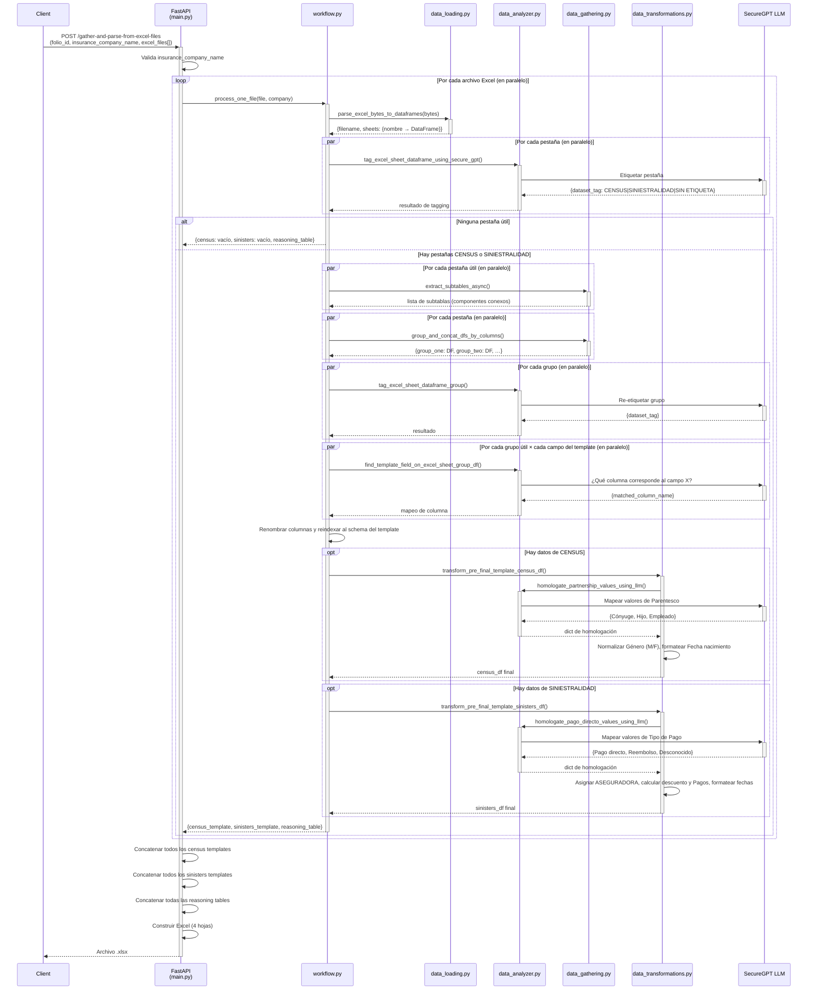

```mermaid
sequenceDiagram
    participant Client
    participant API as FastAPI<br/>(main.py)
    participant WF as workflow.py
    participant Load as data_loading.py
    participant Anal as data_analyzer.py
    participant Gath as data_gathering.py
    participant Trans as data_transformations.py
    participant LLM as SecureGPT LLM

    Client->>+API: POST /gather-and-parse-from-excel-files<br/>(folio_id, insurance_company_name, excel_files[])
    API->>API: Valida insurance_company_name
    
    loop Por cada archivo Excel (en paralelo)
        API->>+WF: process_one_file(file, company)
        WF->>+Load: parse_excel_bytes_to_dataframes(bytes)
        Load-->>-WF: {filename, sheets: {nombre → DataFrame}}

        par Por cada pestaña (en paralelo)
            WF->>+Anal: tag_excel_sheet_dataframe_using_secure_gpt()
            Anal->>+LLM: Etiquetar pestaña
            LLM-->>-Anal: {dataset_tag: CENSUS|SINIESTRALIDAD|SIN ETIQUETA}
            Anal-->>-WF: resultado de tagging
        end

        alt Ninguna pestaña útil
            WF-->>API: {census: vacío, sinisters: vacío, reasoning_table}
        else Hay pestañas CENSUS o SINIESTRALIDAD
            par Por cada pestaña útil (en paralelo)
                WF->>+Gath: extract_subtables_async()
                Gath-->>-WF: lista de subtablas (componentes conexos)
            end

            par Por cada pestaña (en paralelo)
                WF->>+Gath: group_and_concat_dfs_by_columns()
                Gath-->>-WF: {group_one: DF, group_two: DF, …}
            end

            par Por cada grupo (en paralelo)
                WF->>+Anal: tag_excel_sheet_dataframe_group()
                Anal->>+LLM: Re-etiquetar grupo
                LLM-->>-Anal: {dataset_tag}
                Anal-->>-WF: resultado
            end

            par Por cada grupo útil × cada campo del template (en paralelo)
                WF->>+Anal: find_template_field_on_excel_sheet_group_df()
                Anal->>+LLM: ¿Qué columna corresponde al campo X?
                LLM-->>-Anal: {matched_column_name}
                Anal-->>-WF: mapeo de columna
            end

            WF->>WF: Renombrar columnas y reindexar al schema del template

            opt Hay datos de CENSUS
                WF->>+Trans: transform_pre_final_template_census_df()
                Trans->>+Anal: homologate_partnership_values_using_llm()
                Anal->>+LLM: Mapear valores de Parentesco
                LLM-->>-Anal: {Cónyuge, Hijo, Empleado}
                Anal-->>-Trans: dict de homologación
                Trans->>Trans: Normalizar Género (M/F), formatear Fecha nacimiento
                Trans-->>-WF: census_df final
            end

            opt Hay datos de SINIESTRALIDAD
                WF->>+Trans: transform_pre_final_template_sinisters_df()
                Trans->>+Anal: homologate_pago_directo_values_using_llm()
                Anal->>+LLM: Mapear valores de Tipo de Pago
                LLM-->>-Anal: {Pago directo, Reembolso, Desconocido}
                Anal-->>-Trans: dict de homologación
                Trans->>Trans: Asignar ASEGURADORA, calcular descuento y Pagos, formatear fechas
                Trans-->>-WF: sinisters_df final
            end

            WF-->>-API: {census_template, sinisters_template, reasoning_table}
        end
    end

    API->>API: Concatenar todos los census templates
    API->>API: Concatenar todos los sinisters templates
    API->>API: Concatenar todas las reasoning tables
    API->>API: Construir Excel (4 hojas)
    API-->>-Client: Archivo .xlsx
```